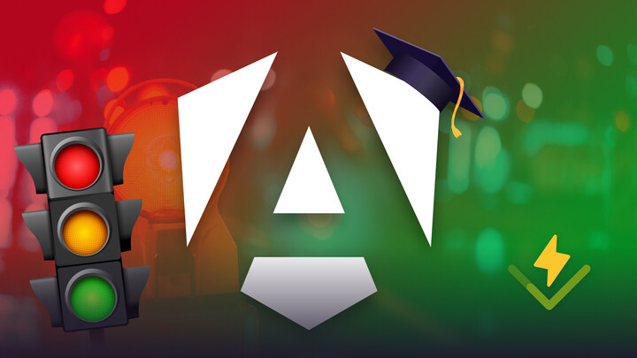

##  Angular Testing In Depth (Signals Edition) Course

This repository contains the code of the [ Angular Testing In Depth (Signals Edition)](https://angular-university.io/course/angular-testing-in-depth) course.

This course repository is updated to Angular v21.

# Installation pre-requisites

Please install Node 22 Long Term Support Edition (LTE).

# Installing the Angular CLI

With the following command the angular-cli will be installed globally in your machine:

    npm install -g @angular/cli 

# How To install this repository

We can install the master branch using the following commands:

    git clone https://github.com/angular-university/angular-testing-in-depth.git
    
After cloning, it's recommended that you install using npm ci. This way you will get the exact dependencies of package-lock.json:
    
    cd angular-testing-in-depth
    npm ci

    npm install 

This should take a couple of minutes. If there are issues, please post the complete error message in the Questions section of the course.

# To Run the Development Backend Server

We can start the sample application backend with the following command:

    npm run server

This is a small Node REST API server.

# To run the Development UI Server

To run the frontend part of our code, we will use the Angular CLI:

    npm start 
    
or simply:

    ng serve 

The application is visible at port 4200: [http://localhost:4200](http://localhost:4200)

# Important 

This repository has multiple branches, have a look at the beginning of each section to see the name of the branch.

It's also possible to download a ZIP file for a given branch,  using the branch dropdown on this page on the top left, and then selecting the Clone or Download / Download as ZIP button.

# Other Courses

# Modern Angular With Signals

If you are looking for the [Modern Angular With Signals Course](https://angular-university.io/course/angular-signals-course), the repo with the full code can be found here:

# Angular Core Deep Dive Course

If you are looking for the [Angular Core Deep Dive Course](https://angular-university.io/course/angular-course), the repo with the full code can be found here:

# RxJs In Practice

If you are looking for the [RxJs In Practice](https://angular-university.io/course/rxjs-course), the repo with the full code can be found here:

# NgRx In Depth

If you are looking for the [NgRx In Depth](https://angular-university.io/course/angular-ngrx-course), the repo with the full code can be found here:

# Serverless Angular with Firebase Course

If you are looking for the [Serverless Angular with Firebase Course](https://angular-university.io/course/firebase-course), the repo with the full code can be found here:

# Angular Universal Course

If you are looking for the [Angular Universal Course](https://angular-university.io/course/angular-universal-course), the repo with the full code can be found here:

# Angular PWA Course

If you are looking for the [Angular PWA Course](https://angular-university.io/course/angular-pwa-course), the repo with the full code can be found here:

# Angular Security Masterclass

If you are looking for the [Angular Security Masterclass](https://angular-university.io/course/angular-security-course), the repo with the full code can be found here:

[Angular Security Masterclass](https://github.com/angular-university/angular-security-course).

# Angular Advanced Library Laboratory Course

If you are looking for the Angular Advanced Course, the repo with the full code can be found here:

[Angular Advanced Library Laboratory Course: Build Your Own Library](https://angular-university.io/course/angular-advanced-course).

## RxJs and Reactive Patterns Angular Architecture Course

If you are looking for the RxJs and Reactive Patterns Angular Architecture Course code, the repo with the full code can be found here:

[RxJs and Reactive Patterns Angular Architecture Course](https://angular-university.io/course/reactive-angular-architecture-course)

## Complete Typescript Course - Build A REST API

If you are looking for the Complete Typescript 2 Course - Build a REST API, the repo with the full code can be found here:

[https://angular-university.io/course/typescript-2-tutorial](https://github.com/angular-university/complete-typescript-course)

[Github repo for this course](https://github.com/angular-university/complete-typescript-course)

